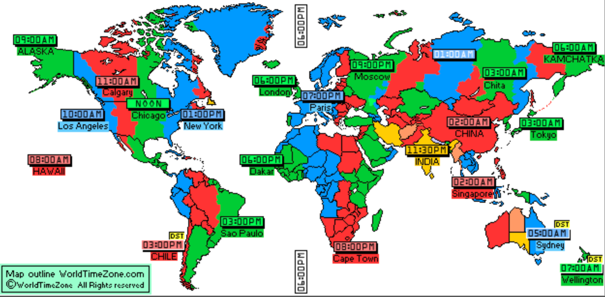

The time of event will be 1800UTC Thursday every 4 weeks, which are 

- 10am US PST (GMT-8)
- 1pm US EST (GMT-5)
- 6pm UK (GMT)
- 7pm Central European Time (GMT+1)
- 8pm Eastern European Time (GMT+2)

## Agenda

## Meeting Links

## Recordings and Notes

## End of Session Checklist
- [ ] Send video recording link and notes link to 
	- [ ] Ethereum Cat Herders (current PoC: Pooja)
	- [ ] Twitter
	- [ ] Ethereum Magician
	- [ ] Discord
	- [ ] Github Issue for session agenda
	- [ ] Github Repo Readme for recording link and note link
- [ ] Create an issue for next meeting
